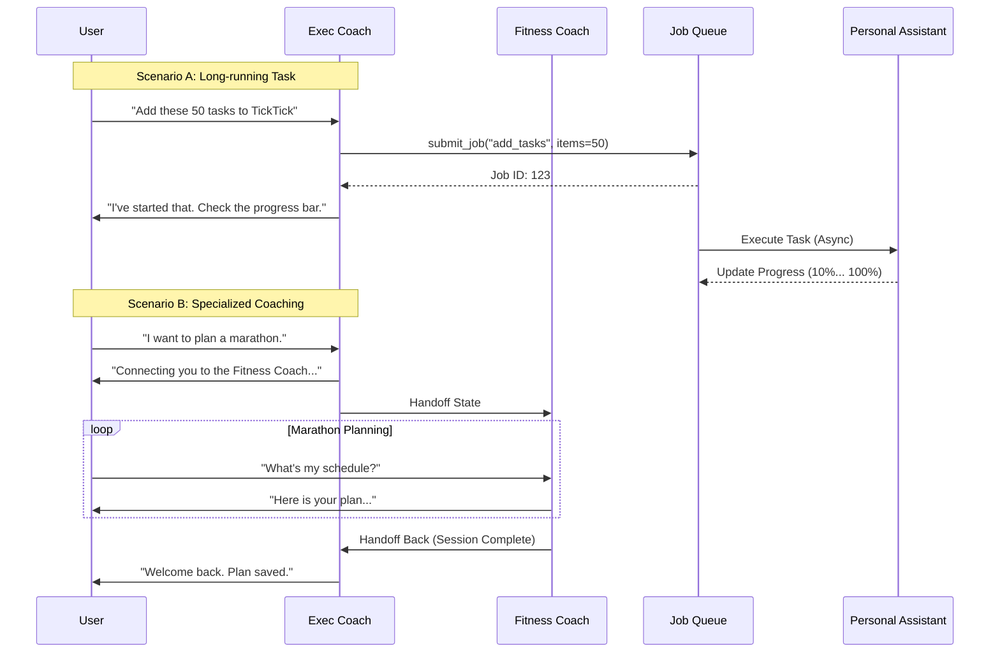

# ADR 001: Async Supervisor & Hierarchical Agent Architecture

**Status**: ✅ Accepted
**Date**: 2026-01-26
**Deciders**: Systems Architect
**Tags**: architecture, langgraph, async, copilotkit, multi-agent
**Version**: v1

## Status Tracking

- **Decision Status**: Accepted
- **Implementation Status**: Not Started

## Context

We are building a "Life Operating System" with a central **Executive Function Coach** and multiple specialized agents (Personal Assistant, Fitness Coach, Nutritionist).

The system has two competing requirements:
1.  **Responsiveness**: Users expect immediate feedback, but agents like the Personal Assistant need to perform long-running tasks (e.g., "Add 50 tasks to TickTick").
2.  **Specialized Interaction**: While the Executive Function Coach is the primary interface, users may need direct, prolonged conversational engagement with specialized agents (e.g., a deep-dive session with the Fitness Coach about a marathon training plan) without the Supervisor mediating every single turn. specialized agents send updates after these conversations to the supervisor to update the system if necessary, add a todo, change the name of a task, etc

## Decision

We will implement a **Hierarchical Asynchronous Architecture** with **Direct Conversational Handoffs**.

### 1. Hybrid Routing Model
- **Supervisor as Gateway**: All interactions start with the Executive Function Coach.
- **Conversational Handoff**: The Supervisor can hand off the *active conversation state* to a specialized agent (Fitness/Nutritionist). These agents become "User-Facing" for the duration of that specific context.
- **Task Delegation (Async)**: For non-conversational, heavy workloads (e.g., Personal Assistant syncing tasks), the Supervisor delegates to a **Background Job Queue**.

### 2. Job Queue Pattern
- **Decoupled Execution**: The Personal Assistant runs primarily as a background worker.
- **Mechanism**: The Supervisor uses a `submit_background_job` tool to dispatch tasks.
- **Feedback**: The Frontend subscribes to job status updates to show progress bars, keeping the chat interactive.

### 3. Architecture Layers
- **Layer 1: Interface & Orchestration**: FastAPI/CopilotKit handling the WebSocket/HTTP connections.
- **Layer 2: specialized Domain Agents**: Distinct `StateGraph` definitions for each domain.
- **Layer 3: Async Execution**: Redis/Celery managing background tasks.
- **Layer 4: Memory & Data**: OpenMemory and Postgres for persistence.

## Rationale

- **User Experience**: Prevents UI freezing during heavy tasks while allowing natural, deep conversations with experts.
- **Scalability**: Heavy I/O operations are offloaded from the real-time chat loop.
- **Modularity**: Specialized agents can evolve independently with their own tools and prompts.

## Alternatives Considered

### Option 1: Single Monolithic Graph
- **Description**: All agents are nodes in one giant graph.
- **Pros**: Shared state is easy.
- **Cons**: Complex to maintain; context window pollution; hard to scale; single failure point.
- **Why not chosen**: Breaks the "Specialization" requirement.

### Option 2: Pure Async (No Direct Chat)
- **Description**: User only talks to Supervisor; Supervisor relays messages to agents.
- **Pros**: Strict control.
- **Cons**: Latency is doubled (User -> Supervisor -> Agent -> Supervisor -> User); loss of conversational nuance.
- **Why not chosen**: The Fitness Coach needs to "feel" like a distinct personality during coaching sessions.

## Consequences

### Positive
- **Flexible Interactions**: Supports both "Do this for me" (Async) and "Talk to me about this" (Handoff).
- **Performance**: Chat remains snappy; heavy lifting happens in the background.
- **Clarity**: Clear distinction between "Planning" (Supervisor) and "Execution" (Workers).

### Negative
- **Complexity**: Managing state handoffs and background job synchronization requires robust state management.
- **Infrastructure**: Requires Redis and worker processes.

## Implementation Notes

### Diagram: Supervisor Flow & Handoffs

## Related Documents

- Plan: `docs/working/plans/phase-1-core-supervisor.md`
- Architecture: `docs/architecture/system-overview.md`
