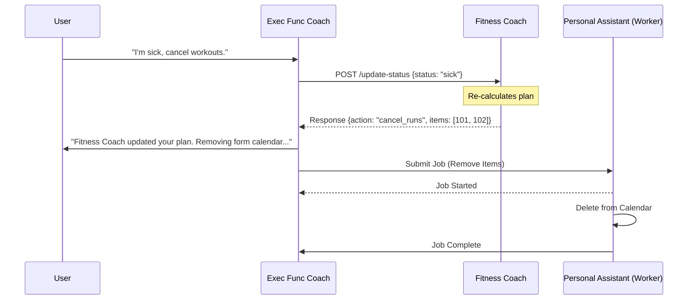

# ADR 002: Federated Agent Architecture (Team of Teams)

**Status**: ✅ Accepted
**Date**: 2026-01-26
**Deciders**: Systems Architect
**Tags**: architecture, federated-agents, a2a, executive-function, api-integration
**Version**: v1

## Status Tracking

- **Decision Status**: Accepted
- **Implementation Status**: Not Started

## Context

We are building a "Life Operating System" with distinct, specialized agents that users can purchase individually. The core is the **Executive Function Coach**, which manages the user's overall life system and coordinates other agents.

Key Requirements:

1.  **Independent Products**: Fitness Coach and Nutritionist are standalone paid agents with their own specialized contexts and user-facing capabilities.
2.  **Central Coordination**: The Executive Function Coach acts as the "Chief of Staff," routing information and requests between agents but NOT performing their specialized work.
3.  **Strict Delegation**: The Personal Assistant is an exclusive tool of the Executive Function Coach. Other agents (Fitness/Nutrition) must request actions through the Exec Func Coach, ensuring the core system stays updated on all life changes.
4.  **Simple Integration**: A2A (Agent-to-Agent) communication should use direct API calls for simplicity, with streamed status updates for UI responsiveness.

## Decision

We will implement a **Federated Agent Architecture** where each agent operates as an independent service within the system, coordinated by the Executive Function Coach via explicit API contracts.

### 1. Agent Roles & Relationships

- **Executive Function Coach (Core)**:
    - **Role**: System Orchestrator & Life Manager.
    - **Responsibility**: Routing user intent, managing global context, and delegating execution tasks.
    - **Exclusive Access**: Owns the **Personal Assistant** background worker.

- **Fitness Coach (Specialist)**:
    - **Role**: Domain Expert (Workouts, Recovery).
    - **Responsibility**: Creating plans, analyzing Strava data.
    - **Constraint**: Cannot directly modify the user's calendar/tasks. Must request changes via Exec Func Coach.

- **Nutritionist (Specialist)**:
    - **Role**: Domain Expert (Diet, Meal Prep).
    - **Responsibility**: Meal planning, grocery lists.
    - **Constraint**: Cannot directly add to shopping lists. Must request add via Exec Func Coach.

### 2. Communication Flow (The "Hub & Spoke" Model)

- **User -> Exec Func Coach**: "I'm skipping workouts this week."
- **Exec Func Coach -> Fitness Coach**: API Call `POST /fitness/update-status` (Context: "User skipping week").
- **Fitness Coach -> Exec Func Coach**: API Call `POST /exec/update-plan` (Payload: "Reschedule runs to next week").
- **Exec Func Coach -> Personal Assistant**: Background Job `update_calendar`.

### 3. A2A API Strategy
- **Direct HTTP Calls**: Agents communicate via internal FastAPI endpoints (e.g., `http://localhost:8000/api/v1/fitness/internal/hook`).
- **Shared State Streaming**: The UI (CopilotKit) subscribes to the *active agent's* state. If Exec Func Coach delegates to Fitness, the UI renders the Fitness Coach's response directly, but the "System of Record" update flows back through the Exec Func Coach.

## Rationale

- **Business Alignment**: Supports the "Paid Agent" model. If a user hasn't bought Fitness Coach, the Exec Func Coach simply lacks that routing capability.
- **Data Integrity**: By forcing all side-effects (Calendar/Task updates) through the Exec Func Coach's Personal Assistant, we ensure the "Life OS" (OpenMemory) never misses a change.
- **Simplicity**: Avoiding a complex Event Bus (RabbitMQ/Kafka) in favor of direct API calls reduces infrastructure overhead for the initial build.

## Alternatives Considered

### Option 1: Mesh Network (Agents talk directly)

- **Description**: Fitness Coach calls Personal Assistant directly to schedule runs.
- **Pros**: Faster execution.
- **Cons**: Executive Function Coach loses visibility. "Life OS" state becomes fragmented.
- **Why not chosen**: Violates the core requirement of Exec Func Coach managing the system and ensures all set goals and trackers are updated properly.

### Option 2: Monolithic Supervisor

- **Description**: Single Graph with Fitness/Nutrition nodes.
- **Pros**: Easy state sharing.
- **Cons**: Monolithic context window; harder to sell agents as separate products; limits specialization.
- **Why not chosen**: Does not support the business model or deep specialization.

## Consequences

### Positive

- **Modular Revenue**: Clear separation for "Add-on" agents.
- **Centralized Truth**: Executive Function Coach remains the authoritative source of the user's life state.
- **Specialized Context**: Fitness Coach context window isn't cluttered with grocery lists.

### Negative

- **Latency**: Multi-hop requests (User -> Exec -> Fitness -> Exec -> PA) introduce delay., if done right communication with user should be constant while longer running tasks and requests happen in the background
- **Dependency**: If Exec Func Coach is down, specialized agents lose their ability to execute side-effects (e.g., schedule items).

## Implementation Notes

### Diagram: Federated Flow

## Related Documents

- Architecture: `docs/architecture/system-overview.md`
- Plan: `docs/working/plans/phase-1-exec-coach.md`
