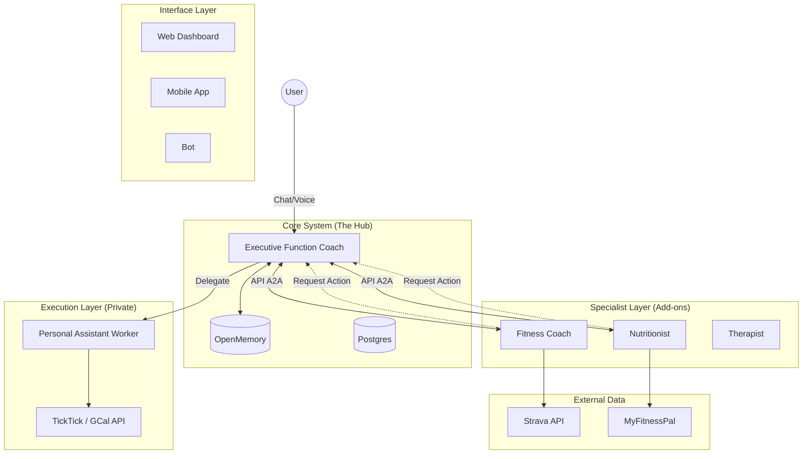

# System Architecture: Life Operating System (Federated Model)

## High-Level Overview

The system is architected as a **Federated Network of Agents**. The **Executive Function Coach** serves as the central hub and user's primary interface for life management. Specialized agents (**Fitness Coach**, **Nutritionist**) are independent, paid add-ons that plug into this hub.

All agents communicate via **Direct API Calls** within a FastAPI environment. The **Personal Assistant** is a dedicated background worker exclusive to the Executive Function Coach, ensuring all life changes (Calendar/Tasks) are centralized.

## System Map

## Component Roles

### 1. Executive Function Coach (The Core)

- **Role**: The "Operating System" of the user's life.
- **Responsibilities**:
    - **Routing**: Decides if a query needs a specialist (e.g., "Workout query" -> Fitness).
    - **Context Management**: Maintains the high-level picture of the user's life in OpenMemory.
    - **Gatekeeper**: Sole authority to approve changes to the user's Calendar/Task list.
- **Interactions**:
    - Receives input from User.
    - Sends context to Specialists.
    - Receives action requests from Specialists.
    - Dispatches tasks to Personal Assistant.

### 2. The Specialists (Fitness, Nutrition, Therapy)

- **Role**: Independent Domain Experts (Productized Add-ons).
- **Responsibilities**:
    - **Deep Dives**: Maintain their own specialized context (e.g., "5RM Bench Press").
    - **Analysis**: Process domain-specific data (Strava, Food Logs).
    - **Strategy**: Formulate plans (Workout Routine, Diet Plan).
- **Constraints**:
    - **Read-Only Context**: Can read global context but cannot modify "Life State" (Calendar/Tasks) directly.
    - **Request-Based Action**: Must ask the Exec Func Coach to implement their plans.

### 3. Personal Assistant (The Hands)

- **Role**: Background Execution Worker.
- **Responsibilities**:
    - **API I/O**: Interacts with TickTick, Google Calendar, Email.
    - **Batch Processing**: Handles bulk updates async.
- **Ownership**: Strictly owned by the Executive Function Coach. Specialists cannot access this directly.

## Data Flow Scenarios

### Scenario A: User Updates Fitness Goal

1.  **User** tells **Exec Func Coach**: "I want to gain 10lbs of muscle."
2.  **Exec Func Coach** identifies "Fitness" intent.
3.  **Exec Func Coach** calls **Fitness Coach API**: `POST /fitness/goal` with payload `{goal: "gain 10 pounds of muscle"}`.
4.  **Fitness Coach** updates its internal model and generates an updated workout plan.
5.  **Fitness Coach** responds to Exec: `{status: "updated", plan_summary: "Hypertrophy Block A"}`.
6.  **Exec Func Coach** updates OpenMemory: "User is in Hypertrophy Block A."

### Scenario B: Fitness Coach Schedules Workouts
1.  **Fitness Coach** determines 4 workouts are needed next week.
2.  **Fitness Coach** calls **Exec Func Coach API**: `POST /exec/request-action` with payload `{action: "schedule", items: [...]}`.
3.  **Exec Func Coach** validates the request against the user's life context (e.g., "Is he on vacation?").
4.  **Exec Func Coach** creates a Job for **Personal Assistant**.
5.  **Personal Assistant** adds events to **Google Calendar**.
6.  **Exec Func Coach** confirms to Fitness Coach: `{status: "scheduled"}`.

## Technology Stack

- **API Gateway**: FastAPI
- **Agent Framework**: LangGraph (Independent Graphs for each agent)
- **Communication**: Internal HTTP (REST)
- **Background Jobs**: Redis Queue (Arq/Celery)
- **Database**: Postgres (User Data, Auth Tokens) + OpenMemory (Vector/Graph Context)
- **Frontend**: Next.js (Web) / Expo (Mobile) with CopilotKit
