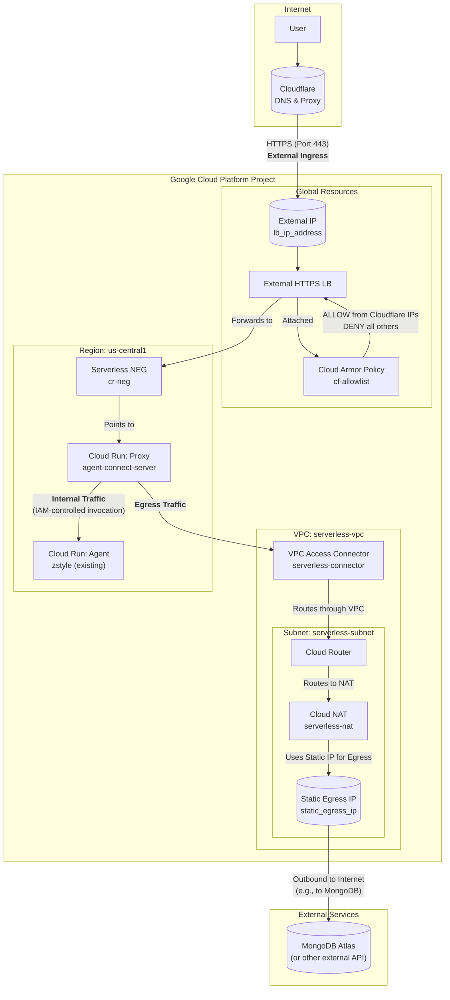

## Terraform Infrastructure Overview

This document provides an overview of the Google Cloud Platform infrastructure defined in this Terraform project. The goal is to securely host the `agent-connect-server` application, control network traffic, and provide stable endpoints for external services.

### Infrastructure Diagram



### Component Breakdown & Traffic Flow

#### 1. External Ingress (User to Application)
This is the path for traffic coming from the public internet into your application.

1.  **User/Client**: Initiates a request to your domain (e.g., `divergelife.com`).
2.  **Cloudflare**: Your domain's DNS is managed by Cloudflare. It receives the request and proxies it to your GCP infrastructure.
3.  **External IP (`lb_ip_address`)**: This is a static, global IP address that serves as the single entry point into your GCP environment. Your Cloudflare 'A' record should point to this IP.
4.  **Cloud Armor (`cf-allowlist`)**: Before traffic can proceed, it hits this security policy. It's configured to **only allow** requests from Cloudflare's IP ranges and **deny** everything else. This protects your load balancer from direct attacks and ensures traffic is funneled through Cloudflare.
5.  **External HTTPS Load Balancer**: If allowed by Cloud Armor, the request reaches the load balancer. It terminates the TLS (HTTPS) connection using the SSL certificate you provide and routes the traffic to the appropriate backend.
6.  **Serverless NEG**: The load balancer's backend is a Serverless Network Endpoint Group. This NEG acts as a connector to your `agent-connect-server` Cloud Run service.
7.  **Cloud Run Proxy (`agent-connect-server`)**: The final destination for the ingress traffic. This service is configured with `ingress = "INGRESS_TRAFFIC_INTERNAL_LOAD_BALANCING"`, which is a critical security setting. It means the service **cannot** be accessed directly from the internet; it only accepts traffic from the internal load balancer it's attached to.

#### 2. Internal Traffic (Service-to-Service)
This is the communication between your two Cloud Run services within GCP.

1.  The **Cloud Run Proxy** receives a request and needs to communicate with the **Cloud Run Agent** (`zstyle`).
2.  It makes a direct, internal HTTP call to the agent service's URL.
3.  This communication is secured using IAM. The proxy's Service Account (`agent-connect-server-sa`) is granted the `roles/run.invoker` role on the agent service, authorizing it to make these calls.

#### 3. Egress (Application to Internet)
This is the path for traffic going from your application out to the public internet (e.g., to connect to your MongoDB Atlas database).

1.  **Cloud Run Proxy**: When the application needs to make an outbound request, its traffic is routed based on its `egress` settings.
2.  **VPC Access Connector**: You've set `egress = "ALL_TRAFFIC"`, which forces all outbound traffic from the Cloud Run service through the `serverless-connector`. This bridges the serverless environment with your VPC network.
3.  **VPC Network (`serverless-vpc`)**: The traffic now flows inside your private VPC.
4.  **Cloud NAT (`serverless-nat`)**: A Cloud Router directs the traffic to the Cloud NAT gateway. The NAT is configured to use a specific static IP address for all outbound connections.
5.  **Static Egress IP (`static_egress_ip`)**: All traffic leaving your VPC via the NAT will appear to come from this single, predictable IP address. You should add this IP to the allowlist in external services like MongoDB Atlas to ensure your application can connect securely.

---

### 4. Managing Infrastructure with Terraform

This section outlines the core workflow for deploying and updating your infrastructure using Terraform, along with essential best practices for security and collaboration.

#### Core Deployment Workflow

These three commands are the foundation of managing infrastructure with Terraform. Always run them from within the `/infra` directory.

1.  **`terraform init`**
    *   **What it does**: Initializes the working directory. It downloads the necessary provider plugins (e.g., for Google Cloud) and sets up the backend for state management.
    *   **When to run it**: Run this once when you first clone the project, and again if you ever change the provider versions or backend configuration.

2.  **`terraform plan`**
    *   **What it does**: Creates an execution plan. Terraform compares your code (`.tf` files) to the real-world infrastructure and shows you exactly what it will create, modify, or destroy. This is a non-destructive dry run.
    *   **When to run it**: **Always run this before applying.** It's your chance to review and confirm the changes are what you expect.
    ```bash
    # Review the plan in your terminal
    terraform plan

    # Optionally, save the plan to a file to apply it exactly later
    terraform plan -out=plan.tfplan
    ```

3.  **`terraform apply`**
    *   **What it does**: Executes the plan and makes the changes to your infrastructure in Google Cloud.
    *   **When to run it**: After you have reviewed the plan and are confident in the changes.
    ```bash
    # This will show the plan again and ask for confirmation
    terraform apply

    # If you saved a plan file, this applies it without re-prompting
    terraform apply "plan.tfplan"
    ```

#### Best Practices

Following these practices is critical for maintaining a secure, stable, and collaborative infrastructure-as-code project.

**1. Remote State Management**
*   **What**: The `terraform.tfstate` file is a JSON file that maps your Terraform resources to real-world objects.
*   **Problem**: By default, this file is stored locally. This is dangerous for teams, as it can lead to state file conflicts, corruption, or accidentally destroying resources.
*   **Best Practice**: Store the state file remotely in a shared, secure location like a **Google Cloud Storage (GCS) bucket**. This provides a single source of truth and uses state locking to prevent multiple people from running `apply` at the same time.

**2. Secrets Management**
*   **What**: Your configuration requires sensitive values, such as the `ssl_key_pem` and `ssl_cert_pem` variables.
*   **Problem**: Committing secrets directly into your Git repository (e.g., in a `.tfvars` file) is a major security vulnerability. Anyone with access to the repository history can see them.
*   **Best Practice**: Store all sensitive data in a dedicated secrets management tool like **Google Secret Manager**.
    *   Your Terraform code can then be configured to read the secrets directly from Secret Manager at runtime.
    *   This ensures secrets are never present in your code, on developer machines, or in your Git history. For CI/CD pipelines, secrets should be injected as secure environment variables.


@JIMMY 
Actions needed to deploy this application
1. create the gcs bucket for the terraform state and plans etc 
2. create two secrets inside secret manager (cf-origin-cert and cf-origin-key)
3. terraform.tfvars.example use for posting to github and fill in with correct values
4. run terraform init, plan, appply 